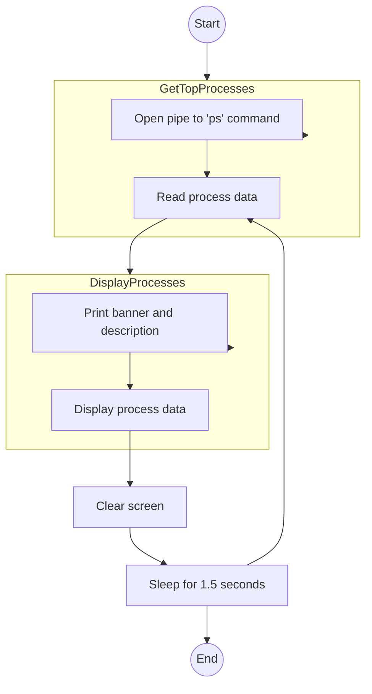

<h1 align=center>conview</h1>
conview is a linux command-line tool designed by <a href="https://github.com/AitzazImtiaz/">Aitzaz Imtiaz</a> under the aid of B-Consortium, in intention to develop a sub-component task manager, acting as a task viewer implementation.


## Background
ConView is a simple logger, which was developed by BS Consortium then, for linux devices, to monitor the activities and tasks running inside linux as a management tool. This was developed as a script initially during "The Great Depression", a term used as a cause for the fall of BS Consortium, and leading into formation of B Consortium. This is the first working project of the consortium, and is approved from BArichive branch of the consortium, with compliance of its rules, to present tools from BS Consortium era to general public.

## Development Stages



## Installation 
``conview`` needs tools like ``gcc``, ``make``,``curl``,``openssl`` and tools to compile both ``make`` and C projects. In that scenario, we can begin like:

```
git clone https://github.com/B-Consortium/conview
cd conview
make conview
sudo make install
```
For administration purposes, the consortium designed [aitshal](https://github.com/B-consortium/aitshal), which is universal tool installer of the consortium. This can be used as:
```
aitshal conview
```
You will notice that ``conview`` will not return anything, but work on ``sudo conview``. However, the code remains in root, which can be removed securely from device user to access:
```
cd
rm ConView -r
```
